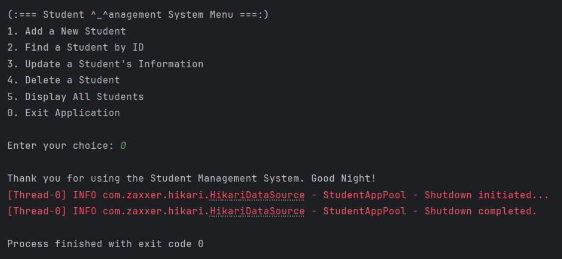
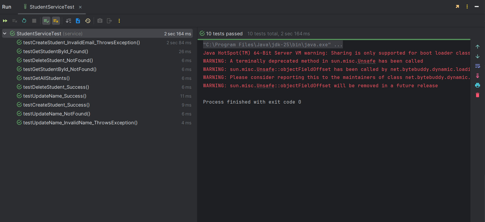
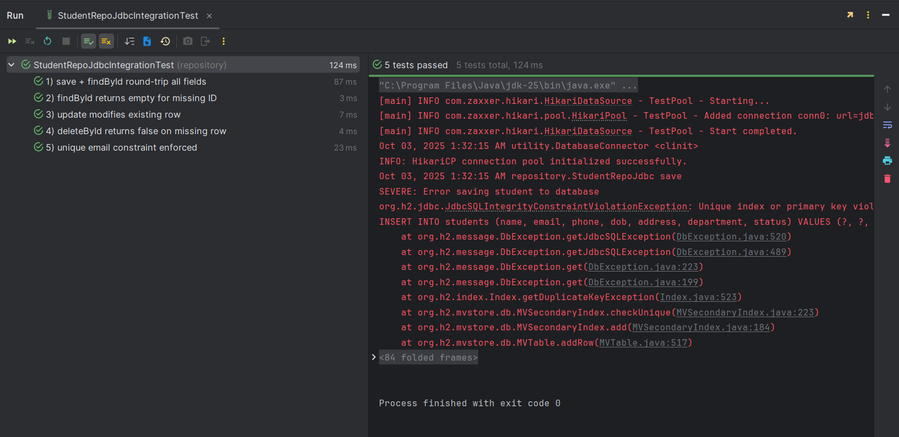

> [!NOTE]
> **Copyright © 2025 `Anupam Kushwaha`.**
>
> All rights reserved. Unauthorized reproduction, distribution, or modification of this project, in whole or in part, is strictly prohibited.

# Student Management System v2.0 (Java + JDBC + MySQL)

A robust console application for managing student records, upgraded from JSON storage to a professional-grade JDBC + MySQL backend with secure, externalized configuration and HikariCP connection pooling. Integration tests run on an H2 in-memory database for fast, deterministic feedback.

---

## 🚀 V2.0 Highlights

- Database migration: JSON → MySQL via JDBC with prepared statements.
- Performance: HikariCP connection pool for efficient DB access.
- Security: Credentials externalized to db.properties (not committed).
- Testing: Repository integration tests on H2 (MySQL compatibility mode).
- Structure: Clean, layered architecture ready for future frameworks.

---

## 📦 Features

- Full CRUD on students: create, read, update, delete.
- Immutable data model using Java records for clarity and safety.
- Layered design: UI → Service → Repository for clean separation.
- Unique email constraint enforced at DB level.
- Professional logging and error handling patterns.

---

## 🧱 Architecture

- Presentation: Console UI (main menu and flows).
- Service: Business logic via `StudentService`.
- Repository: `StudentRepoJdbc` (JDBC + SQL) implementing `StudentRepo`.
- Model: `Student` record and enums (Departments, Status).
- Config: Externalized via `db.properties` (runtime) and test config for H2.

---

## ✅ Requirements

- JDK 25 (or newer compatible JDK).
- MySQL 8.x (runtime).
- HikariCP + MySQL Connector/J on classpath.
- JUnit 5 + H2 for integration testing.
- IntelliJ IDEA (recommended) or any Java IDE.

---

## ⚙️ Setup (Runtime: MySQL)

### 1) Create database and table

```sql
CREATE DATABASE IF NOT EXISTS student_system;
USE student_system;

CREATE TABLE IF NOT EXISTS students (
  id INT PRIMARY KEY AUTO_INCREMENT,
  name VARCHAR(100) NOT NULL,
  email VARCHAR(100) NOT NULL UNIQUE,
  phone VARCHAR(20) NOT NULL,
  dob DATE NOT NULL,
  address VARCHAR(255),
  department VARCHAR(50) NOT NULL,
  status VARCHAR(50) NOT NULL,
  created_at TIMESTAMP DEFAULT CURRENT_TIMESTAMP,
  updated_at TIMESTAMP DEFAULT CURRENT_TIMESTAMP ON UPDATE CURRENT_TIMESTAMP,
  INDEX idx_name (name),
  INDEX idx_department (department),
  INDEX idx_status (status)
);
```

---

### 2) Configure credentials (do not commit real secrets)

Create: `src/main/resources/db.properties`

```properties
jdbc.url=jdbc:mysql://localhost:3306/student_system?useSSL=false&serverTimezone=UTC
jdbc.user=your_mysql_user
jdbc.password=your_mysql_password
hikari.poolName=AppPool
hikari.maximumPoolSize=10
hikari.connectionTimeout=30000
```

---

### 3) Graceful shutdown (recommended)

In your main class:

<pre>

Runtime.getRuntime().addShutdownHook(new Thread(DatabaseConnector::closePool));

</pre>


---

## ▶️ Run

- Ensure MySQL is running and `db.properties` is configured.
- Start the app from the main entry class; the console menu and service logic remain unchanged—only persistence is now JDBC-backed.

---

## 🧪 Testing (Integration: H2)

Use H2 (in-memory) to run fast integration tests for the repository.

### 1) Test DB config

Create: `src/test/resources/db.properties`

```properties
jdbc.url=jdbc:h2:mem:student_system_test;MODE=MySQL;DB_CLOSE_DELAY=-1
jdbc.user=sa
jdbc.password=
hikari.poolName=TestPool
hikari.maximumPoolSize=4
hikari.connectionTimeout=20000
```

---

### 2) Test schema (H2 only—no DROP/CREATE DATABASE/USE)

Create: `src/test/resources/schema-h2.sql`

```sql
DROP TABLE IF EXISTS students;

CREATE TABLE students (
  id INT PRIMARY KEY AUTO_INCREMENT,
  name VARCHAR(100) NOT NULL,
  email VARCHAR(100) NOT NULL UNIQUE,
  phone VARCHAR(20) NOT NULL,
  dob DATE NOT NULL,
  address VARCHAR(255),
  department VARCHAR(50) NOT NULL,
  status VARCHAR(50) NOT NULL
);
```

---

### 3) What the tests validate

- `save` returns a `Student` with generated id and all fields round-trip via `findById`.
- `findById` returns empty for unknown IDs.
- `update` persists changes and returns the updated entity.
- `deleteById` returns true for existing rows, false otherwise.
- Duplicate email insert throws `RuntimeException` (assert with `assertThrows`).

---

## 📜 Repository Contract

- `save(name, email, phone, dob, address, department, status)` → `Student`
    - Returns created `Student` with generated id.
    - Throws `RuntimeException` on DB constraint violations (e.g., duplicate email).
- `findById(id)` → `Optional<Student>`
- `update(student)` → `Optional<Student>` (empty if id not found)
- `deleteById(id)` → `boolean`
- `findAll()` → `List<Student>`

---

## 🔄 Migration Notes (v1 → v2)

- Replaced JSON storage with MySQL via JDBC (`StudentRepoJdbc`).
- Introduced `DatabaseConnector` with HikariCP and externalized config.
- Added H2-backed repository integration tests.
- Kept/optional: in-memory repo for service unit tests only.
- Main wiring: instantiate `StudentRepoJdbc` in place of in-memory repo.
- Added JVM shutdown hook to close the connection pool.

---

## 🛠️ Troubleshooting

- **“schema file not found” during tests**  
  Ensure `schema-h2.sql` exists under `src/test/resources` and is on test classpath.

- **H2 errors like “DROP DATABASE/USE not supported”**  
  Keep H2 schema limited to table DDL only.

- **Duplicate email insert fails**  
  Expected: `save` throws `RuntimeException`. Test with `assertThrows`.

- **Connection leaks / pool not closing**  
  Use try-with-resources in repository methods and register the shutdown hook.

---

## 📸 Screenshots

<details>
  <summary>1️⃣ Adding Student</summary>
  <br>
  
</details>

<details>
  <summary>2️⃣ Exiting Application</summary>
  <br>
  
</details>

<details>
  <summary>3️⃣ Unit Testing</summary>
  <br>
  
</details>

<details>
  <summary>4️⃣ Integration Testing</summary>
  <br>
  
</details>


---

## 👤 Author

**Anupam Kushwaha**  
- GitHub: [anupamkushwaha85](https://github.com/anupamkushwaha85)  
- LinkedIn: [Anupam Kushwaha](https://www.linkedin.com/in/anupamkushwaha85)
- Email: [anupamkushwaha639@gmail.com](mailto:anupamkushwaha639@gmail.com)
- X (Twitter): [@SE_Anupam](https://x.com/SE_Anupam)