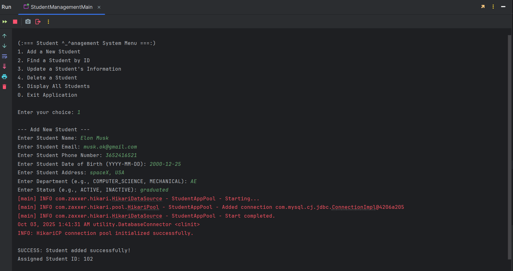

# Student Management System (Java + JSON) v1.0

A simple, robust, and console-based application for managing student records, built with Java (JDK 23). This project demonstrates core Java principles, object-oriented design, and best practices in software development, including data persistence with JSON, a layered architecture, and comprehensive unit testing.

## Project Purpose & Learning Journey

The primary motivation behind this project was to bridge the gap between academic knowledge and professional software development. Key learning objectives included:

* **Professional Workflow:** From writing well-documented code to structured debugging and testing.
* **Dependency Management:** Gaining hands-on experience by manually resolving classpath issues and dependency conflicts between JDK 23, JUnit 5, and Mockito—challenges that are learned in the trenches, not in textbooks.
* **Unit Testing:** Implementing thorough unit tests for the service layer using JUnit 5 and Mockito to ensure business logic is correct and robust.

---

## Table of Contents

- [Features](#features)
- [Architecture](#architecture)
- [Technologies Used](#technologies-used)
- [Getting Started](#getting-started)
    - [Prerequisites](#prerequisites)
    - [Installation and Running](#installation-and-running)
- [Application Showcase](#application-showcase)
- [Design Patterns and Principles](#design-patterns-and-principles)
- [Author](#author)

---

## Features

- **CRUD Operations:** Full support for creating, reading, finding, updating, and deleting student records.
- **Data Persistence:** Student data is automatically saved to a `students.json` file on exit and loaded on startup using the Gson library.
- **Robust Validation:** A dedicated `ValidationUtils` class ensures all user inputs (name, email, phone, date of birth) are valid before processing. Age is also validated to be within a reasonable range.
- **Immutable Data Model:** The `Student` data carrier is implemented as a Java `record`, ensuring it is a transparent and truly immutable data aggregate by design. This modern approach reduces boilerplate and enhances thread safety and data integrity.
- **Dynamic Greeting:** The application greets the user with a time-appropriate message (e.g., "Good Morning," "Have a Good Day," "Good Night") upon exit.
- **Layered and Flexible Architecture:** The project's structure is cleanly separated and flexible, making it easy to add or modify features in future versions.
- **Comprehensive Exception Handling:** Implemented robust exception handling to manage invalid inputs and potential runtime errors gracefully.

---

## Architecture

This project is built using a classic 3-tier layered architecture to ensure separation of concerns and maintainability. **This structure is directly reflected in the package organization, with distinct packages like `ui`, `service`, and `repository` clearly separating the different concerns of the application.**

1.  **Presentation Layer (UI):** `mainMenu.StudentManagementMain` is responsible for all console input and output.
2.  **Service Layer (Business Logic):** `service.StudentService` orchestrates operations and enforces business rules.
3.  **Data Access Layer (Repository):** `repo.StudentRepo` handles data storage and retrieval...

---
## Technologies Used

- **Core:** **Java (JDK 23)** with the **Java Platform Module System (JPMS)** for a modular application structure.
- **Data Storage:** **Gson 2.13.2** for JSON serialization/deserialization.
    - Implemented **custom `TypeAdapter`s** to solve advanced serialization challenges:
        - A `LocalDateAdapter` to ensure `java.time.LocalDate` objects are consistently serialized as a simple **`"yyyy-MM-dd"` string**, rather than Gson's default, complex JSON object.
        - A `StudentTypeAdapter` to manage the **immutable `Student` class**, which lacks a no-argument constructor. This ensures that all business-level validations are enforced even during deserialization from the JSON file.
- **Unit Testing:** **JUnit 5** and **Mockito 5** for testing the service layer.
- **Logging:** `java.util.logging` to track application flow and capture detailed error messages and stack traces, facilitating easier debugging and maintenance.

---

## Getting Started

Follow these instructions to get a copy of the project up and running on your local machine. This project does not use a build tool like Maven or Gradle, so dependencies (JAR files) must be managed manually.

### Prerequisites

- **Java Development Kit (JDK) 23** or higher.
- The following **JAR files** for running the application and its tests. You will need to add these to your project's classpath in your IDE or during command-line compilation.
    - **Runtime:** `gson-2.13.2.jar`
    - **Testing:**
        - `apiguardian-api-1.1.2.jar`
        - `byte-buddy-1.14.17.jar`
        - `byte-buddy-agent-1.14.17.jar`
        - `junit-jupiter-api-5.10.2.jar`
        - `junit-jupiter-engine-5.10.2.jar`
        - `junit-jupiter-params-5.10.2.jar`
        - `junit-platform-commons-1.10.2.jar`
        - `mockito-core-5.12.0.jar`
        - `mockito-junit-jupiter-5.12.0.jar`
        - `opentest4j-1.3.0.jar`

### Installation and Running

1.  **Clone the repository:**
    ```bash
    git clone [https://github.com/anupamkushwaha85/Student-management-system.git](https://github.com/anupamkushwaha85/Student-management-system.git)
    ```
2.  **Navigate to the project directory:**
    ```bash
    cd Student-management-system
    ```
3.  **Run the application:**
    The application is designed to be run directly from an IDE (like IntelliJ or VS Code). Simply open the project and run the `src/mainMenu/StudentManagementMain.java` file.

   4.  **Run the unit tests:**
       To verify the business logic, run the test file `test/StudentServiceTest.java` from your IDE.

**Note on First Use:**
       For professional practice, the `students.json` data file is not included in the repository. On the first run, the system will be empty. 
       Your first step should be to use **Option 1: Add Student** to create a record. After adding one or more students, all other features will be fully functional.

---
<details>
<summary>Click to view Application Showcase</summary>


## Application Showcase

Here is a showcase of the application's core features, from the main menu to data validation and testing.

**1. Main Menu**
The clean and simple entry point for all operations.


---

**2. Adding a Student**
Adding a student records that will auto save in json file.


---

**3. Displaying All Students**
Viewing all student records currently stored in the system.


---

**4. Finding a Specific Student**
Searching for a single student by their unique ID.


---

**5. Updating a Student's Record**
The interactive sub-menu for modifying a student's details.


---

**6. Deleting a Student**
Removing a student record from the system.


---

**7. Robust Input Validation**
The application gracefully handles invalid input, such as an incorrect date of birth format, preventing bad data.


---

**8. Successful Unit Tests**
Proof of a well-tested service layer with 10 successful unit tests executed via the JUnit test runner.

</details>

---

## Design Patterns and Principles

This project demonstrates several key software design principles:

- **Immutability:** The `Student` class is immutable, ensuring that student data objects are predictable and safe to share.
- **Repository Pattern:** The `StudentRepo` interface abstracts the data persistence mechanism, allowing the underlying storage to be changed without affecting the business logic.
- **Separation of Concerns:** Each layer of the architecture (UI, Service, Repository) has a distinct and single responsibility.
- **Dependency Injection:** Dependencies are provided via constructors, promoting loose coupling and making the classes easier to test.

---

## Author

**Anupam Kushwaha**

- **GitHub:** [github.com/anupamkushwaha85](https://github.com/anupamkushwaha85)
- **LinkedIn:** [linkedin.com/in/anupamkushwaha85](https://www.linkedin.com/in/anupamkushwaha85)
- **Email:** [anupamkushwaha639@gmail.com](mailto:anupamkushwaha639@gmail.com)
- **X (Twitter):** [@SE_Anupam](https://x.com/SE_Anupam)